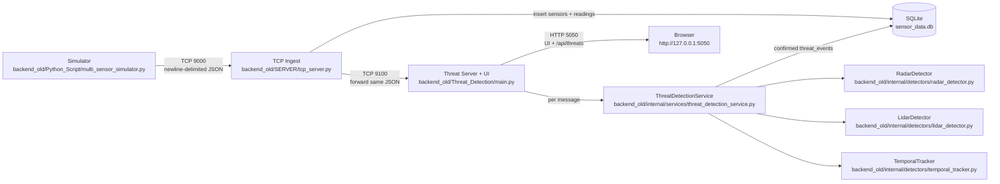

# Backend (backend_old/) — Simulation → Ingestion → Threat Detection

This document describes the **backend_old** pipeline end-to-end: how synthetic RADAR/LIDAR data is generated, how it is ingested and stored, how threats are detected and scored, and how results are served live via a UI/API.

It is written as an office-ready technical note: mix of paragraphs + key bullet points, plus a flow diagram.

---

## 1) Executive summary (what this backend does)

The backend_old system simulates multiple RADAR and LiDAR sensors, streams their readings over TCP, persists raw readings in SQLite, forwards the same stream to a threat-detection service, and exposes a small Flask dashboard that shows live detection results.

Operationally, it is a 3-process pipeline:

1. **Simulator** generates JSON messages (RADAR + LiDAR) continuously.
2. **TCP ingest server** receives, stores raw readings, and forwards the stream.
3. **Threat detection server** consumes forwarded messages, scores threats, persists threat events, and serves a UI.

---

## 2) System flow diagram (ports + components)



---

## 3) Runtime components, ports, and run order

**Ports**

- Sensor ingest TCP server: `127.0.0.1:9000`
- Threat stream listener: `127.0.0.1:9100`
- Threat UI/API (Flask): `127.0.0.1:5050`

**Run order (important)**

1. Start `backend_old/Threat_Detection/main.py` first (it opens `9100` and `5050`).
2. Start `backend_old/SERVER/tcp_server.py` next (it opens `9000` and forwards to `9100`).
3. Start `backend_old/Python_Script/multi_sensor_simulator.py` last (it connects to `9000`).

**Typical commands (3 terminals, in project root, with venv active)**

Terminal 1:

```powershell
cd C:\Users\SaniyaAshfakKadarbha\Desktop\sensor_project
.\venvs\Scripts\Activate.ps1
python backend_old\Threat_Detection\main.py
```

Terminal 2:

```powershell
cd C:\Users\SaniyaAshfakKadarbha\Desktop\sensor_project
.\venvs\Scripts\Activate.ps1
python backend_old\SERVER\tcp_server.py
```

Terminal 3:

```powershell
cd C:\Users\SaniyaAshfakKadarbha\Desktop\sensor_project
.\venvs\Scripts\Activate.ps1
python backend_old\Python_Script\multi_sensor_simulator.py
```

---

## 4) Data contracts (payload schemas)

All messages are newline-delimited JSON.

### 4.1 RADAR payload

```json
{
  "sensor_id": "RADAR_1",
  "type": "radar",
  "timestamp": "2026-03-12T10:00:00Z",
  "raw_detection": {
    "range_m": 20.0,
    "azimuth_deg": 0.0,
    "elevation_deg": 1.0,
    "radial_velocity_mps": -3.0,
    "rcs_dbsm": 25.0,
    "snr_db": 15.0
  }
}
```

### 4.2 LiDAR payload

```json
{
  "sensor_id": "LIDAR_1",
  "type": "lidar",
  "timestamp": "2026-03-12T10:00:01Z",
  "raw_detection": {
    "bounding_box": {
      "x_min": -1.0,
      "y_min": 5.0,
      "z_min": 0.1,
      "x_max": 2.0,
      "y_max": 10.0,
      "z_max": 1.8
    },
    "centroid": {"x": 0.5, "y": 7.5, "z": 0.95},
    "point_count": 120,
    "intensity_avg": 180.0,
    "velocity_mps": 1.2,
    "aspect_ratio": 1.7,
    "point_density_ppm2": 50.0
  }
}
```

---

## 5) Database layer (SQLite) — what gets stored and why

This pipeline uses a single SQLite DB file: `sensor_data.db` at project root.

There are two categories of storage:

- **Raw readings** (for audit/debug and offline analysis)
  - `radar_readings` and `lidar_readings`
- **Threat events** (business output)
  - `threat_events`

**Schema (conceptual)**

- `sensors(sensor_id, sensor_type)`
- `radar_readings(sensor_id, raw_detection, timestamp)`
- `lidar_readings(sensor_id, raw_detection, timestamp)`
- `threat_events(sensor_id, sensor_type, threat_type, confidence, severity, timestamp)`

**Implementation note (important for maintainability)**

The DB operations are abstracted behind a class `Database` in the `database/` package:

- `database/sqlite_db.py` defines `Database` (schema + CRUD)
- `database/models.py` defines dataclass models that mirror tables

This design avoids importing many standalone functions into servers.

---

## 6) Business logic: what “threat detection” means in this project

At a business level, “threat detection” here is a **rule-based risk scoring** system over sensor attributes.

- A **detector** converts a single reading into 0..N “detected objects”.
- Each detected object has a `type` and a `confidence` score in `[0, 1]`.
- If confidence exceeds a global threshold (default `0.6`), the object is treated as a threat candidate.
- A temporal layer can require persistence across frames (currently configured for realtime confirmation).

The final output of the threat layer is:

- A UI list of recent confirmed detections
- Inserts into the `threat_events` table

---

## 7) Scoring system and attributes used (the “why” behind detections)

### 7.1 Global threshold and normalization

Common logic is implemented in `backend_old/internal/detectors/base_detector.py`:

- Every score is clamped to `[0, 1]`.
- A detection is emitted when `score >= 0.6`.
- Payload structure and numeric fields are validated.

### 7.2 RADAR threat scoring

Implemented in `backend_old/internal/detectors/radar_detector.py`.

**Attributes used**

- `range_m` (distance)
- `radial_velocity_mps` (approach/escape speed)
- `rcs_dbsm` (Radar Cross Section — proxy for object size/material)
- `snr_db` (Signal-to-Noise Ratio — signal quality)
- plus angle fields for physics validation: `azimuth_deg`, `elevation_deg`

**Detection types and scoring (rule weights)**

1) `RADAR_OBJECT_MOVING`

- `+0.3` if `abs(radial_velocity_mps) > 0.5`
- `+0.2` if `rcs_dbsm > 15`
- `+0.2` if `snr_db > 10`
- `+distance_risk(range_m)`
- if `snr_db < 3`, apply penalty `score *= 0.7`
- clamp to `[0, 1]` and detect if `>= 0.6`

2) `RADAR_OBJECT_FAST_APPROACHING`

- `+0.4` if `radial_velocity_mps < -2.0` (fast approaching)
- `+0.2` if `snr_db > 10`
- `+0.2` if `rcs_dbsm > 15`
- `+distance_risk(range_m)`
- low-SNR penalty if `snr_db < 3`

3) `RADAR_OBJECT_HIGH_RCS`

- `+0.5` if `rcs_dbsm > 15`
- `+0.2` if `snr_db > 10`
- `+distance_risk(range_m)`
- low-SNR penalty if `snr_db < 3`

4) `RADAR_OBJECT_STATIONARY_LARGE`

- `+0.3` if `abs(radial_velocity_mps) < 0.1`
- `+0.3` if `rcs_dbsm > 15`
- `+0.1` if `snr_db > 10`
- `+distance_risk(range_m)`
- low-SNR penalty if `snr_db < 3`

**Distance risk function (used in multiple rules)**

- `+0.4` if range `< 5m`
- `+0.3` if range `< 10m`
- `+0.2` if range `< 20m`
- `+0.1` if range `< 50m`
- `+0.0` otherwise

**Severity classification (RADAR only)**

RADAR detections call `SeverityEngine.classify(confidence, distance, velocity)`:

- `risk_score = confidence + distance_bonus + velocity_bonus`
- distance bonus: `+0.4` (<3m), `+0.3` (<5m), `+0.2` (<10m), `+0.1` (<20m)
- velocity bonus (by absolute speed): `+0.3` (>10), `+0.2` (>5), `+0.1` (>2)
- mapping:
  - `>= 1.2` → `CRITICAL`
  - `>= 0.9` → `HIGH`
  - `>= 0.6` → `MEDIUM`
  - else `LOW`

### 7.3 LiDAR threat scoring

Implemented in `backend_old/internal/detectors/lidar_detector.py`.

**Attributes used**

- `bounding_box` (x/y/z min/max)
- `point_count`
- `point_density_ppm2`
- `velocity_mps`

Derived geometry:

- `width = x_max - x_min`
- `depth = y_max - y_min`
- `height = z_max - z_min`
- `volume = width * depth * height`

**Noise gating**

- If `point_count < 10`, the detection returns **no objects** (treated as noise cluster).

**Detection types and scoring (rule weights)**

1) `LIDAR_OBJECT_LARGE`

- `+0.5` if `volume > 5.0`
- `+0.3` if `point_count > 100`
- `+0.2` if `density > 40.0`

2) `LIDAR_OBJECT_DENSE`

- `+0.5` if `point_count > 100`
- `+0.3` if `density > 40.0`
- `+0.2` if `volume > 2.5` (half of large threshold)

3) `LIDAR_OBJECT_MOVING`

- `+0.5` if `abs(velocity_mps) > 0.5`
- `+0.3` if `point_count > 100`
- `+0.2` if `density > 40.0`
- if `abs(velocity_mps) < 0.1`, apply penalty `score *= 0.7`

4) `LIDAR_OBJECT_TALL`

- `+0.6` if `height > 1.5`
- `+0.4` if `volume > 2.5`

5) `LIDAR_OBJECT_WIDE`

- `+0.6` if `width > 2.0`
- `+0.4` if `point_count > 100`

6) `LIDAR_OBJECT_HIGH_POINT_DENSITY`

- `+0.7` if `density > 40.0`
- `+0.3` if `point_count > 100`

LiDAR detections currently return `type`, `confidence`, and `metadata` (no severity field).

---

## 8) Temporal confirmation (persistence across frames)

Temporal confirmation is implemented by `backend_old/internal/detectors/temporal_tracker.py`.

- It keeps a per-sensor rolling window of the last N frames.
- It confirms a threat type only if it appears at least M times in that window.

Current configuration is set in `ThreatDetectionService.__init__`:

- `history_size=1`
- `confirmation_threshold=1`

This means **realtime confirmation**: if the detector emits an object in a single frame, it is considered confirmed and can be inserted into `threat_events`.

If your office expects more realistic false-positive control, the intended “stability mode” is:

- `history_size=5`
- `confirmation_threshold=3`

---

## 9) File-by-file: what each backend_old component does

### 9.1 Sensor generation layer

`backend_old/Model/sensors.py`

- Defines `RadarSensor` and `LidarSensor` generators.
- Outputs Python dict payloads conforming to the schemas in section 4.

`backend_old/Python_Script/multi_sensor_simulator.py`

- Prompts for number of RADAR and LiDAR sensors.
- Starts a daemon thread per sensor.
- Each thread connects to `127.0.0.1:9000` and sends `json + "\n"` every 2 seconds.
- Automatically retries if the TCP server is not running.

### 9.2 Ingestion/persistence/forwarding

`backend_old/SERVER/tcp_server.py`

- Accepts multiple clients on `9000`.
- Parses newline-delimited JSON safely with a buffer.
- Calls DB operations via a `Database` instance:
  - `db.register_sensor(message)`
  - `db.insert_radar_reading(message)` or `db.insert_lidar_reading(message)`
- Forwards the same JSON payload to threat server on `9100`.
- Uses a reusable `threat_socket` with reconnect logic.

### 9.3 Threat detection + UI

`backend_old/Threat_Detection/main.py`

- Listens on `9100` and consumes forwarded messages.
- For each message, calls `ThreatDetectionService.process(message)`.
- Stores runtime stats and recent results in memory.
- Serves:
  - `/` dashboard
  - `/api/threats` JSON for polling in UI

`backend_old/Threat_Detection/real_time_detector.py` (optional)

- Alternate/legacy path that connects directly to the ingest server (`9000`) and runs detection locally.
- The primary architecture is `tcp_server.py` (9000) forwarding to `main.py` (9100).

`backend_old/internal/services/threat_detection_service.py`

- Routes message to `RadarDetector` or `LidarDetector`.
- Applies `TemporalTracker` confirmation.
- Persists confirmed threats via `Database.insert_threat_event(...)`.

---

## 10) Troubleshooting notes (common runtime issues)

**Port already in use (WinError 10048)**

- Cause: an older instance of the server is still running.
- Fix: stop the old process (Ctrl+C) or kill the Python PID holding the port.

**UI shows “Unable to fetch threat data”**

- Cause: `main.py` (Flask server) is not running or you stopped it with Ctrl+C.
- Fix: restart `backend_old/Threat_Detection/main.py`.

**Threats not appearing in DB**

- Ensure the pipeline processes are running in the correct order.
- Ensure `sensor_data.db` is the same file being used by all processes (the `Database` class uses an absolute path).
- Confirm temporal confirmation settings (section 8).

**Key logic**
- Validates bounding box geometry and measurement ranges.
- Computes geometric features: width, depth, height, volume.
- Applies threshold-based multi-signal scoring.
- Optionally dampens near-zero velocity detections as noise.

---

### `backend_old/internal/detectors/severity_engine.py`

**Purpose**
- Maps confidence + physical cues into risk severity labels.

**Output labels**
- `LOW`, `MEDIUM`, `HIGH`, `CRITICAL`

**Inputs**
- confidence score (mandatory), optional distance and velocity.

---

### `backend_old/internal/detectors/temporal_tracker.py`

**Purpose**
- Reduces false positives by confirming detections that persist across frames.

**Mechanism**
- Keeps rolling history per `sensor_id`.
- Counts repeated object types across recent frames.
- Returns only those reaching `confirmation_threshold`.

**Defaults**
- `history_size = 5`
- `confirmation_threshold = 3`

## 6) Database integration points (outside backend_old)

Although this document focuses on `backend_old`, it depends on root-level `database.py`.

### `database.py` responsibilities

- Creates tables:
  - `sensors`
  - `radar_readings`
  - `lidar_readings`
  - `threat_events`
- Inserts incoming raw sensor payloads.
- Inserts confirmed threat events from threat detection service.

## 7) Recommended startup sequence

1. Start threat listener + UI:
   - `python backend_old/Threat_Detection/main.py`
2. Start ingest server:
   - `python backend_old/SERVER/tcp_server.py`
3. Start simulator:
   - `python backend_old/Python_Script/multi_sensor_simulator.py`

## 8) One-line architecture summary

`multi_sensor_simulator.py` → `tcp_server.py` (store + forward) → `Threat_Detection/main.py` (detect + confirm + UI) → `database.py` (`threat_events`).
