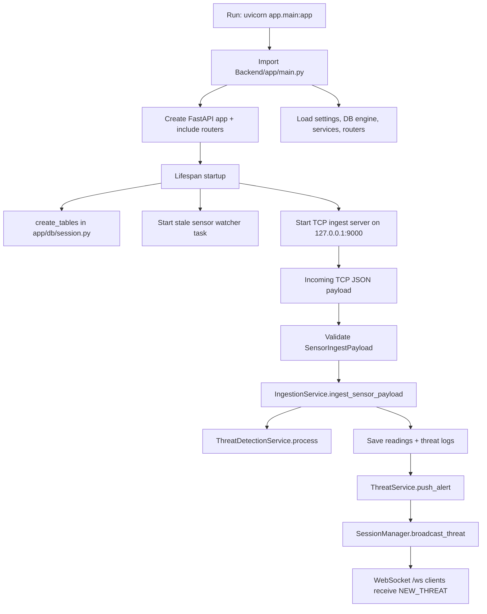
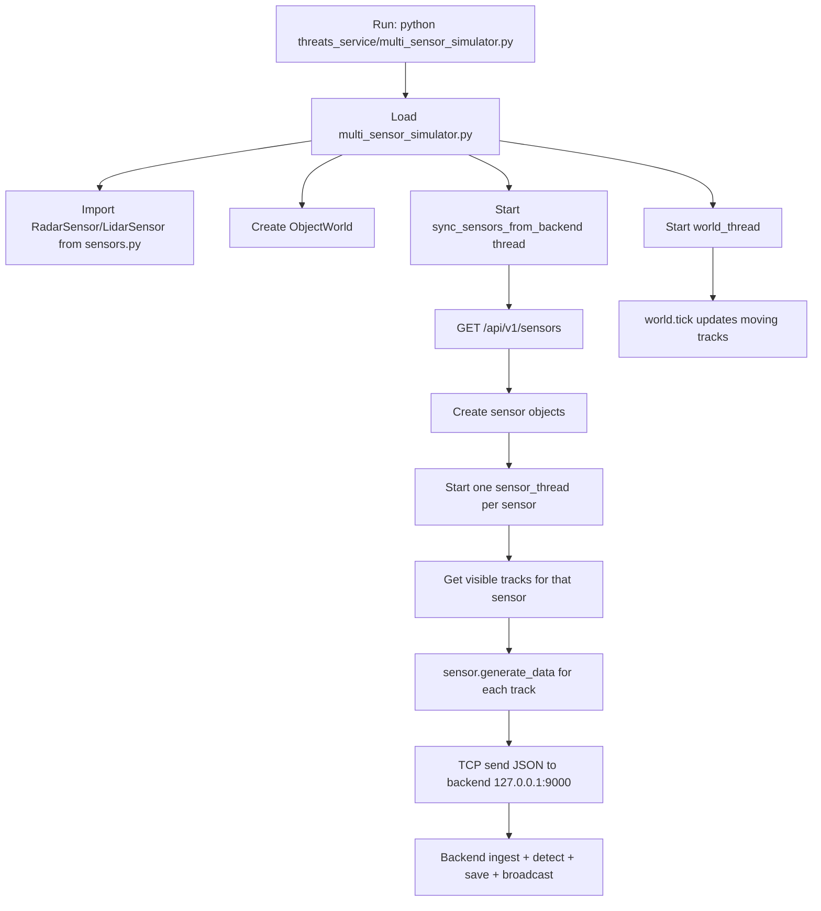
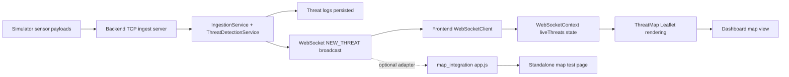

# Backend + Simulator + Map Integration Execution Flow

This document explains, in execution order, what runs first, which files are involved, and how they reference each other for:

1. Backend startup command
2. Simulator startup command
3. Map integration flow

Commands covered:

- Backend: `python -m uvicorn app.main:app --host 127.0.0.1 --port 8000`
- Simulator: `python multi_sensor_simulator.py`

## 1. Backend Execution Flow (When Uvicorn Starts)

### 1.1 What executes first

When you run Uvicorn with `app.main:app`, Python does this first:

1. Import module `app.main`.
2. Execute top-level code in `Backend/app/main.py`.
3. Locate exported variable `app` (FastAPI instance).
4. Start server event loop.
5. Run FastAPI lifespan startup block.

### 1.2 Import and initialization chain

Primary entry file:

- `Backend/app/main.py`

Important imports pulled during startup:

- `Backend/app/config.py` (creates `settings` object)
- `Backend/app/db/__init__.py` -> `Backend/app/db/session.py` (DB engine, sessionmaker, `create_tables`)
- `Backend/app/services/tcp_ingest_server.py` (creates TCP ingest server instance)
- `Backend/app/services/ingestion_service.py` (creates ingestion service and detector)
- `Backend/app/routers/__init__.py` (loads all API routers)

Indirect files used through those imports:

- Detection: `Backend/app/detection/threat_detection_service.py`, `Backend/app/detection/radar_detector.py`, `Backend/app/detection/lidar_detector.py`, `Backend/app/detection/temporal_tracker.py`
- Models: `Backend/app/models/sensor.py`, `Backend/app/models/sensor_reading.py`, `Backend/app/models/threat_log.py`, `Backend/app/models/user.py`
- WebSocket broadcast: `Backend/app/services/ws_session_manager.py`, `Backend/app/services/threat_service.py`
- Schemas used for validation: `Backend/app/schemas/ingest.py`, plus other router-specific schema files

### 1.3 What happens during lifespan startup

Defined in `Backend/app/main.py` (`lifespan`):

1. `await create_tables()` runs from `Backend/app/db/session.py`.
2. DB table/index setup and Timescale hypertable statements run.
3. Stale-sensor watcher task starts (`_stale_sensor_watcher_loop`).
4. TCP ingest server starts if enabled (`tcp_ingest_server.start()`) and listens on configured host/port (default 127.0.0.1:9000).

### 1.4 Runtime ingest path (what happens after startup)

The TCP server receives JSON messages and routes them through:

1. `Backend/app/services/tcp_ingest_server.py`
2. Validates message with `SensorIngestPayload` (`Backend/app/schemas/ingest.py`)
3. Calls `ingestion_service.ingest_sensor_payload(...)` in `Backend/app/services/ingestion_service.py`
4. Threat detection runs in `Backend/app/detection/threat_detection_service.py`
5. Readings and threat logs are stored through model mappings
6. Each saved threat is broadcast using `threat_service.push_alert(...)`
7. `session_manager.broadcast_threat(...)` emits WebSocket message type `NEW_THREAT`

### 1.5 Backend execution diagram

### 1.6 Quick file-role map (backend)

- `Backend/app/main.py`: Entry module, FastAPI app object, startup/shutdown orchestration.
- `Backend/app/config.py`: Environment-driven settings.
- `Backend/app/db/session.py`: DB engine/session setup + table/hypertable initialization.
- `Backend/app/services/tcp_ingest_server.py`: TCP listener that accepts simulator payloads.
- `Backend/app/services/ingestion_service.py`: Validation-to-detection-to-persistence flow.
- `Backend/app/detection/*.py`: Radar/lidar detection logic.
- `Backend/app/services/threat_service.py`: WebSocket alert push entry point.
- `Backend/app/services/ws_session_manager.py`: Connected client registry and broadcasts.
- `Backend/app/routers/*.py`: REST and WebSocket endpoints.

---

## 2. Simulator Execution Flow (multi_sensor_simulator.py)

### 2.1 What executes first

When you run `python multi_sensor_simulator.py` from `threats_service`:

1. Python executes top-level code in `threats_service/multi_sensor_simulator.py`.
2. It imports sensor classes from `threats_service/sensors.py`.
3. It reads environment variables and constants (backend URL, intervals, object counts).
4. It creates a shared object world (`world = ObjectWorld()`).
5. It starts background threads:
   - world tick thread
   - backend sensor-sync thread
6. Main thread remains alive in an infinite sleep loop.

### 2.2 How simulator uses other files/services

Core local files:

- `threats_service/multi_sensor_simulator.py`
- `threats_service/sensors.py`

External/backend files it depends on at runtime:

- `Backend/app/routers/sensor.py` via HTTP GET `/api/v1/sensors` (for sensor registry)
- `Backend/app/services/tcp_ingest_server.py` via TCP socket 127.0.0.1:9000 (for ingest)

### 2.3 Simulator runtime loop details

Inside `sync_sensors_from_backend()` in `multi_sensor_simulator.py`:

1. Fetch sensor list from backend REST endpoint.
2. Build sensor objects using `_build_sensor(...)`:
   - `RadarSensor` from `sensors.py`
   - `LidarSensor` from `sensors.py`
3. Start one streaming thread per sensor (`sensor_thread`).
4. Stop threads for sensors removed from backend list.

Inside each `sensor_thread(...)`:

1. Connect to backend TCP ingest port.
2. Query visible tracks from `ObjectWorld.visible_tracks_for_sensor(...)`.
3. Generate payloads with `sensor.generate_data(track)`.
4. If no visible tracks, generate background payload.
5. Send JSON payload bytes to TCP server continuously.

### 2.4 Simulator execution diagram

### 2.5 Quick file-role map (simulator)

- `threats_service/multi_sensor_simulator.py`: Process entrypoint and orchestration.
- `threats_service/sensors.py`: Payload generation logic for radar/lidar.
- `Backend/app/routers/sensor.py`: Source of sensor config list consumed by simulator.
- `Backend/app/services/tcp_ingest_server.py`: Sink receiving simulator payload stream.

---

## 3. Map Integration Flow

Map integration in this repository exists in two layers:

1. Live dashboard map path (main Frontend app)
2. Standalone map integration test module (`map_integration`)

### 3.1 Live dashboard map path (production app flow)

Backend side:

1. Threat detected in `Backend/app/services/ingestion_service.py`.
2. `threat_service.push_alert(...)` called (`Backend/app/services/threat_service.py`).
3. `session_manager.broadcast_threat(...)` sends WebSocket message from `Backend/app/services/ws_session_manager.py`.
4. Message type: `NEW_THREAT` on `/ws` endpoint (`Backend/app/routers/websocket.py`).

Frontend side (for map display):

1. WebSocket client connects using `Frontend/src/app/services/WebSocketClient.ts`.
2. `Frontend/src/app/context/WebSocketContext.tsx` stores incoming live threats.
3. `Frontend/src/app/components/ThreatMap.tsx` renders sensors + threat positions on Leaflet map.
4. `Frontend/src/app/pages/Dashboard.tsx` mounts `ThreatMap`.

### 3.2 Standalone map integration module (`map_integration`)

This is an independent test harness:

- `map_integration/index.html`
- `map_integration/app.js`
- `map_integration/styles.css`
- `map_integration/mock_ws_server.py`

It renders a Leaflet map and expects message types like:

- `snapshot`
- `sensor_update`
- `object_update`

So this module is useful for quick map testing and demos, but it is separate from the main frontend message format.

### 3.3 Map integration diagram

## 4. Summary in one line per command

- Backend command starts `Backend/app/main.py`, builds app/services/db, then lifespan starts DB init + TCP server + stale-sensor watcher.
- Simulator command starts `threats_service/multi_sensor_simulator.py`, syncs sensors from backend, streams radar/lidar payloads to backend TCP ingest.
- Map integration displays threat outputs broadcast from backend WebSocket, either in main frontend (`ThreatMap`) or the standalone `map_integration` test app.
